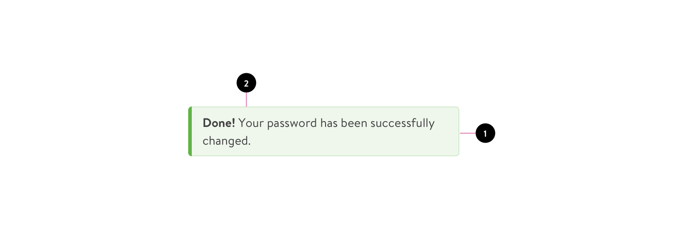
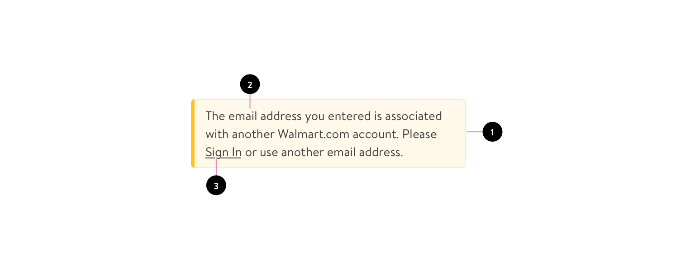
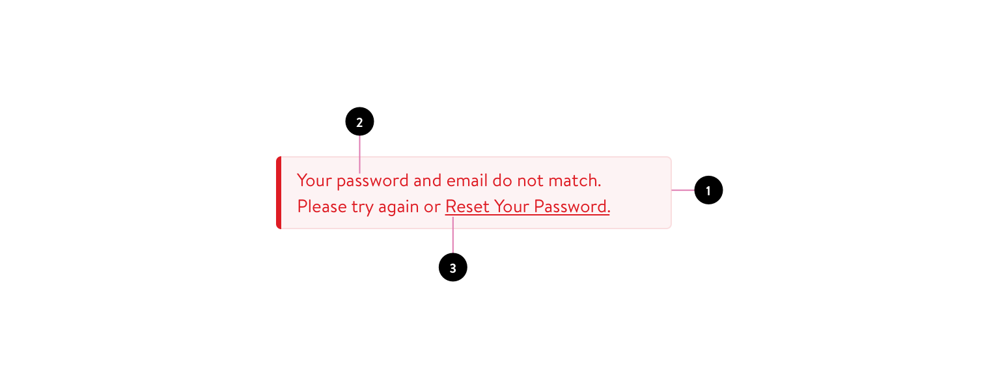
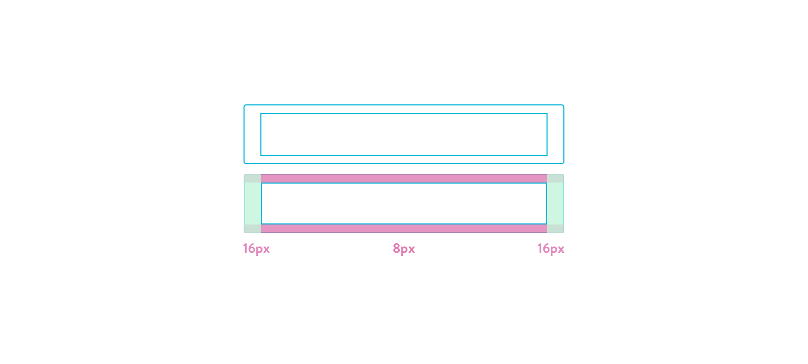
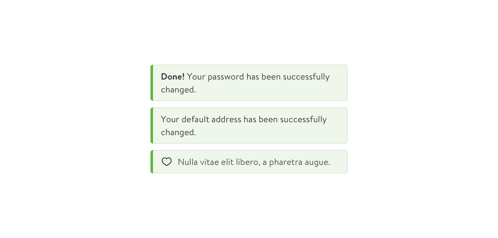
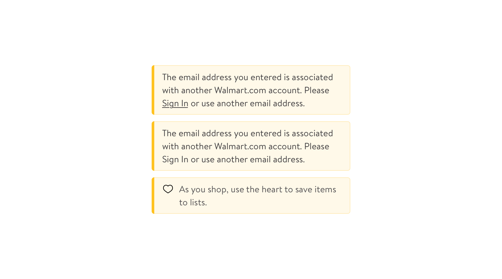
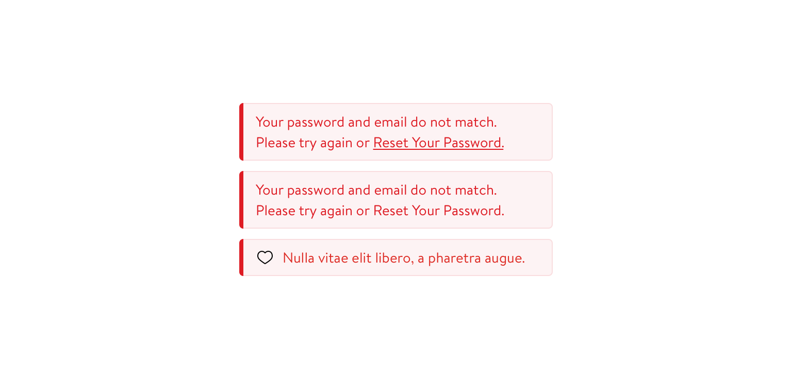
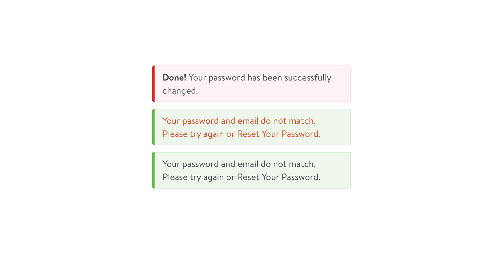

# Global Messaging — Rweb

## Description
Global messages provide brief information about application processes—often at the top of the screen  

## Anatomy & Variations

### Confirmation Message
Send a confirmation message.  

1. Container 
2. Label

### Information Message
Relay imporant infomation. May have an action present.

1. Container 
2. Label 
3. Text action

### Warning Message
Relay errors or other critical information. May have an action present.

1. Container 
2. Label 
3. Text action

## States & Specs
General specs and differents states for each Message type

### Message Skeleton

Width: 304px  
Height: Auto  
Left/Right padding: 16px  
Top/Bottom padding: 8px  
Border Radius (Round Corners): 4px  
Font size: 14px  

### Confirmation Message States

Text Color: #414042 Midnight-Grey  
Background Color/Fill: #F1F7EE Green-Fill  
Top Border: 1px  
Right Border: 1px  
Bottom Border: 1px  
Top, Right, Bottom, Border Color: #D2E9CA Green-Stroke  
Left Border: 4px  
Left Border Color: #5FB446 Market-Green

<!--
width: 304px;  
height: auto;  
font-size: 14px;  
line-height: 1.5em;  
padding: 8px 16px;  
color: #414042;  
background-color: #F1F7EE;  
border-top: 1px solid #D2E9CA;  
border-right: 1px solid #D2E9CA;  
border-bottom: 1px solid #D2E9CA;  
border-left: 4px solid #5FB446;  
border-radius: 4px;
-->

### Information Message States

Text Color: #414042 Midnight-Grey  
Background Color/Fill: #FFF9E9 Fill  
Top Border: 1px  
Right Border: 1px  
Bottom Border: 1px  
Top, Right, Bottom, Border Color: #FFECBC Info Spark Yellow  
Left Border: 4px  
Left Border Color: #FFC220 Spark-Yellow

### Warning Message States

Text Color: #414042 Midnight-Grey  
Background Color/Fill: #FEF7F7
Top Border: 1px  
Right Border: 1px  
Bottom Border: 1px  
Top, Right, Bottom, Border Color:  
Left Border: 4px  
Left Border Color:

## Behavior & Scalability

## General Consideration
Rules to consider when using theses components

Do Not change the color of messages. This can obfuscate the message intent and importance. It can confuse customers.

## Examples in Context

## Related Patterns  
